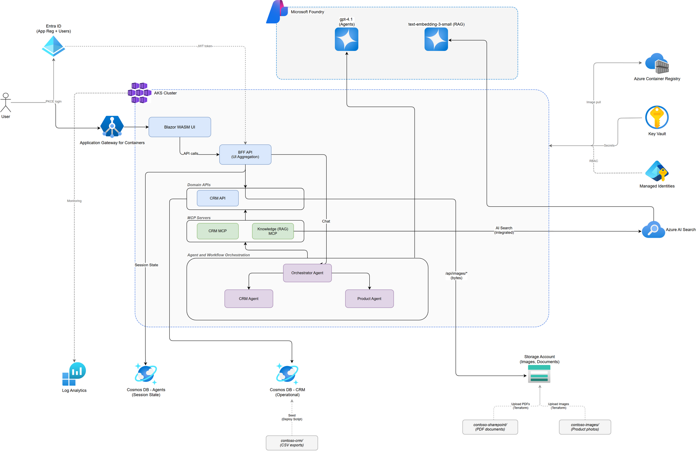

# dotnet-agent-framework

.NET Agent Framework tutorials for building agentic AI systems, based on [Microsoft Agent Framework](https://learn.microsoft.com/en-us/agent-framework/overview/?pivots=programming-language-csharp).

## Architecture



*Edit the source: [docs/architecture.drawio](docs/architecture.drawio) — open in [draw.io](https://app.diagrams.net)*

### Overview

This system implements a Contoso Outdoors customer service platform where AI agents handle customer inquiries using structured order/product data and unstructured knowledge documents (via RAG). The architecture follows a **hybrid data access pattern** — shared REST APIs where multiple consumers exist, direct database access where only one consumer exists.

```text
                     ┌──────────────────────────────────────────────────────────────────────┐
                     │  AKS Cluster                                                        │
                     │                                                                      │
 User ──► Blazor UI ─┤── (chat) ──────► Orchestration Pods ◄── Agent Definitions (lib)      │
              │       │                   │             │                                    │
              │       │                   │             ▼                                    │
              │       │                   │        Azure OpenAI (chat completions)           │
              │       │                   ▼                                                  │
              │       │             MCP Servers                                              │
              │       │        ┌──────┬──────┬──────┬──────┐                                │
              │       │        │      │      │      │      │                                │
              │       │        ▼      ▼      ▼      ▼      ▼                                │
              │       │      Cust&  Product Product Knowledge                              │
              │       │      Orders  Catalog Images  (RAG) MCP                              │
              │       │      MCP    MCP    MCP              │                                │
              │       │        │      │      │              └─► Cosmos DB Knowledge (direct) │
              ▼       │      Cust&  Product Product             + Embedding Model            │
             BFF ─────┤──►  Orders  Catalog Images                                          │
              │       │      API    API    API (Blob)                                        │
              │       │       └──────┴──────┘                                                │
              │       │                   │                                                  │
              │       └───────────────────┼──────────────────────────────────────────────────┘
              │                           │
              │                           ▼
              │                     Cosmos DB Operational (CRM data)
              │
              │          Cosmos DB Agents (state — written directly by orchestrator)
              │
              └── (direct data: tables, dashboards) ──► BFF ──► Domain APIs
```

### Architectural decisions

#### 1. Hybrid data access — REST APIs where shared, direct where exclusive

The system uses a **hybrid pattern** rather than forcing all traffic through REST APIs or allowing everything to access databases directly. The deciding principle: **use shared REST APIs when multiple consumers exist; go direct when only one consumer exists.**

| Data Store | UI needs it? | Agents need it? | Access pattern | Why |
|------------|:---:|:---:|---|---|
| **Operational** (orders, products) | ✅ | ✅ | Shared domain APIs | Both UI (via BFF) and agents (via MCP → domain APIs) need the same data. Shared APIs prevent duplicating data access logic, validation, and business rules. |
| **Knowledge** (RAG vectors) | ❌ | ✅ | MCP → Cosmos DB direct | Only agents perform vector similarity search. This is a compound AI operation (embed query → `VectorDistance` search → return chunks) that no other consumer needs. Routing it through a REST API adds a pointless hop. |
| **Knowledge** (doc metadata) | Maybe | ❌ | Domain API endpoint | If an admin UI needs to browse/manage documents (titles, categories), that's simple CRUD — add a domain API endpoint. But vector search remains agent-only. |
| **Agents** (state) | ❌ | ✅ | Orchestrator → Cosmos DB direct | Internal conversation history and agent memory. No other consumer needs this. |

**Why not "everything through REST APIs"?** The Blazor UI needs direct data access for tables, dashboards, and admin views — not everything flows through an agent. If MCP Servers also access Cosmos DB directly for CRM data, we'd duplicate repositories, validation, and business rules in two places. But forcing the Knowledge MCP Server through a REST API for an operation only agents perform is over-engineering — adding a network hop and an extra service layer with zero consumers besides the MCP Server itself.

**The MCP specification is agnostic on this.** MCP tools can "[query databases, call APIs, or perform computations](https://modelcontextprotocol.io/specification/2025-03-26)" — the spec doesn't prescribe one pattern over the other. The official [MCP reference servers](https://github.com/modelcontextprotocol/servers) include both: `server-sqlite` (direct DB) and `server-github` (calls REST API).

#### 2. Domain-specific APIs with a BFF layer

The data layer is split into **three domain-specific APIs**, each owning its Cosmos DB containers and business logic. A **[Backend for Frontend (BFF)](https://learn.microsoft.com/en-us/azure/architecture/patterns/backends-for-frontends)** sits between the Blazor UI and the domain APIs, aggregating cross-domain calls into UI-optimized responses.

| Domain API | Cosmos Containers | Key Operations |
|---|---|---|
| **Customer & Orders API** | Customers, Orders, OrderItems, SupportTickets | Get/update customers, orders, order items, support tickets |
| **Product Catalog API** | Products, Promotions | Get products, promotions, eligibility checks |
| **Product Images API** | Azure Blob Storage (product-images container) | Get product images, list images by category |

All domain APIs except Product Images share the **Operational** Cosmos DB account but own separate containers. The Product Images API reads from Azure Blob Storage. Each API has its own clean architecture (Services → Repositories → Models).

**Why domain APIs instead of one monolith?** Each domain has distinct scaling, deployment, and security requirements. Domain APIs can be deployed independently — a product catalog fix doesn't require redeploying the customer orders service.

**Why a BFF?** The Blazor UI needs cross-domain views: an order detail page shows customer info (Customer & Orders) + product details (Product Catalog) + product images (Product Images) on one screen. The BFF aggregates these into UI-optimized endpoints. Domain APIs know about business rules. The BFF knows about UI views. Neither duplicates the other's concerns.

**MCP servers don't use the BFF.** Each MCP server calls its corresponding domain API directly — it's already scoped to a single domain. The BFF exists solely because the UI needs cross-domain aggregation.

**Cross-domain MCP operations:** Some tools need data from multiple domains (e.g., `get_eligible_promotions` needs the customer's loyalty tier from Customer & Orders). The domain API handles this via API-to-API calls internally — the promotion eligibility logic belongs in the Product Catalog API, not in the MCP adapter.

#### 3. MCP Servers are thin protocol adapters

Each MCP Server exposes [tools](https://modelcontextprotocol.io/docs/concepts/tools) with names, descriptions, and schemas that the LLM uses for function calling. The Customer & Orders/Product Catalog MCP Servers translate between MCP protocol and HTTP calls to their corresponding domain APIs. The Product Images MCP Server translates between MCP protocol and Azure Blob Storage calls. The Knowledge MCP Server translates between MCP protocol and Cosmos DB + Embedding Model calls. None of them contain business logic — that lives in the domain APIs (for shared data) or in the MCP tool handler itself (for the RAG compound operation).

#### 4. Four domain-specific MCP Servers

Tools are grouped by domain boundary, with each MCP server calling exactly one backend:

| MCP Server | Tools | Calls |
|---|---|---|
| **Customer & Orders** | `get_all_customers`, `get_customer_detail`, `get_customer_orders`, `get_order_detail`, `get_support_tickets`, `create_support_ticket` | Customer & Orders API |
| **Product Catalog** | `search_products`, `get_product_detail`, `get_promotions`, `get_eligible_promotions` | Product Catalog API |
| **Product Images** | `get_product_image`, `list_product_images` | Azure Blob Storage (product-images container) |
| **Knowledge (RAG)** | `search_knowledge_base` | Knowledge Cosmos DB direct + Embedding Model |

This 1:1 alignment between MCP servers and domain APIs keeps each adapter simple and independently deployable.

#### 5. Agent definitions are a shared library, not separate deployments

In [Microsoft Agent Framework](https://learn.microsoft.com/en-us/agent-framework/agents/), an agent is an **in-process object** — a configuration of (LLM client + system prompt + tools). Creating an agent is a few lines of code:

```csharp
AIAgent agent = new AzureOpenAIClient(...)
    .GetChatClient("gpt-4.1")
    .AsAIAgent(
        instructions: "You are a CRM specialist...",
        tools: [.. crmTools]);
```

Agents are not deployed as separate pods. They are instantiated inside whichever orchestration needs them. A `CrmAgent` factory method returns the same agent configuration whether it's used in a single-agent scenario, a handoff pattern, or a magentic group.

```text
src/
  agents/                          ← SHARED CLASS LIBRARY (not a pod)
    AgentDefinitions.cs
    CustomerOrdersAgent               → system prompt + Customer & Orders MCP tools
    ProductCatalogAgent                → system prompt + Product Catalog MCP tools
    ProductImagesAgent                 → system prompt + Product Images MCP tools
    KnowledgeAgent                     → system prompt + Knowledge MCP tools
    ReviewerAgent                      → system prompt + quality review prompt
    ManagerAgent                       → system prompt + no tools (orchestrates only)

  orchestrations/                  ← DEPLOYABLE PODS (each references shared library)
    single-agent/                  → Creates 1 agent with ALL tools, exposes HTTP endpoint
    reflection/                    → Creates Primary + Reviewer in-process, exposes endpoint
    handoff/                       → Creates intent classifier + specialists, exposes endpoint
    magentic/                      → Creates Manager + specialists, exposes endpoint
```

This means:

- Agent configurations are **defined once, reused across patterns** — no duplication.
- Each orchestration pod references the shared library, instantiates the agents it needs, and composes them using the appropriate workflow pattern.
- Adding a new pattern means adding a new orchestration pod, not redefining agents.

#### 6. Agent orchestrator owns agent state

Each orchestration pod writes directly to the **Agents** Cosmos DB account for conversation history and agent memory. This state is owned by the orchestration layer — it doesn't belong in the shared REST API surface because no other consumer needs it.

#### 7. APIM as an optional external gateway

For external access (partner integrations, multi-tenant scenarios), [Azure API Management](https://learn.microsoft.com/en-us/azure/api-management/api-management-key-concepts) sits in front of the MCP Servers — handling JWT validation, tenant routing, and rate limiting. Internal traffic within AKS bypasses APIM.

### Workflow orchestration patterns

The same agent definitions can be composed into different orchestration patterns. [Microsoft Agent Framework](https://learn.microsoft.com/en-us/agent-framework/overview/?pivots=programming-language-csharp) supports both autonomous [agents](https://learn.microsoft.com/en-us/agent-framework/agents/) (LLM-driven steps) and explicit [workflows](https://learn.microsoft.com/en-us/agent-framework/workflows/) (developer-defined execution paths). Each pattern reuses the same MCP tools and domain APIs — the difference is how agents are composed and coordinated.

Each orchestration pattern is deployed as a separate pod in AKS with its own HTTP endpoint. The Blazor UI routes to the appropriate endpoint based on user selection.

#### Single agent

One agent with access to all MCP tools handles the entire conversation.

```text
User ↔ Agent (all tools) ↔ LLM
```

- **Agents used:** 1 (all tools via all MCP servers)
- **When to use:** Simple Q&A, single-domain tasks, prototyping
- **LLM calls per turn:** 1
- **Docs:** [Agent Framework — Agents](https://learn.microsoft.com/en-us/agent-framework/agents/)

#### Sequential

Agents process tasks one after another. The output of one agent becomes the input of the next.

```text
User → Agent A → Agent B → Agent C → Result
```

- **Agents used:** N (each with domain-specific tools)
- **When to use:** Multi-step processing, data enrichment, review chains
- **LLM calls per turn:** N (one per agent)
- **Docs:** [Agent Framework — Workflows](https://learn.microsoft.com/en-us/agent-framework/workflows/)

#### Reflection

A primary agent generates a response, then a reviewer agent evaluates quality. If the reviewer rejects, the primary refines. Loops up to a configurable maximum.

```text
User → Primary Agent → Reviewer → [APPROVE or refine] → Response
```

- **Agents used:** Primary (domain tools) + Reviewer (no tools, quality prompt)
- **When to use:** Quality assurance, compliance checking, high-stakes responses
- **LLM calls per turn:** 2–4 (depends on refinement rounds)
- **Docs:** [Agent Framework — Workflows](https://learn.microsoft.com/en-us/agent-framework/workflows/)

#### Concurrent (fan-out / fan-in)

Multiple agents process the same input in parallel. Results are aggregated.

```text
User → [Agent A, Agent B, Agent C] → Aggregator → Result
```

- **Agents used:** N specialist agents + 1 aggregator
- **When to use:** Multi-perspective analysis, parallel research, consensus
- **LLM calls per turn:** N (parallel) + 1 (aggregator)
- **Docs:** [Agent Framework — Workflows](https://learn.microsoft.com/en-us/agent-framework/workflows/)

#### Handoff

An intent classifier routes the conversation to a domain specialist. Specialists communicate directly with the user. When a specialist detects an out-of-domain request, it triggers a handoff to another specialist. Classification is lazy — runs only on first message or handoff detection.

```text
User ↔ Intent Classifier → Specialist A ↔ User
                          → Specialist B ↔ User (on handoff)
```

- **Agents used:** CrmBillingAgent, ProductPromotionsAgent, SecurityAgent (from shared library)
- **When to use:** Multi-domain customer service, clear domain boundaries
- **LLM calls per turn:** 1–2 (specialist + optional reclassification)
- **Docs:** [.NET AI — Agents (Handoff)](https://learn.microsoft.com/en-us/dotnet/ai/conceptual/agents)

#### Magentic (group chat with orchestrator)

A manager agent coordinates specialist agents. Specialists only communicate with the manager — never directly with the user. The manager plans, delegates to specialists, synthesizes responses, and delivers the final answer.

```text
User ↔ Manager → Specialist A
               → Specialist B → Manager → Response
               → Specialist C
```

- **Agents used:** ManagerAgent + CustomerOrdersAgent, ProductCatalogAgent, ProductImagesAgent (from shared library)
- **When to use:** Complex multi-domain queries requiring synthesis and planning
- **LLM calls per turn:** 3–10+ (manager + specialists + replanning)
- **Docs:** [.NET AI — Agents (Magentic)](https://learn.microsoft.com/en-us/dotnet/ai/conceptual/agents)

#### Choosing a pattern

| Consideration | Single | Sequential | Reflection | Concurrent | Handoff | Magentic |
|:---|:---:|:---:|:---:|:---:|:---:|:---:|
| Complexity | Low | Medium | Medium | Medium | Medium | High |
| Latency | Low | Medium | Medium | Low | Low | High |
| LLM cost per turn | Low | Medium | Medium | Medium | Low | High |
| Quality control | — | — | ✅ | — | — | ✅ |
| Multi-domain | — | — | — | — | ✅ | ✅ |
| Parallelism | — | — | — | ✅ | — | — |

### AKS pod summary

| Pod | Type | Connects to |
|---|---|---|
| **Blazor UI** | Frontend | BFF (data views), Orchestration pods (chat) |
| **BFF** | Aggregation | Customer & Orders API, Product Catalog API, Product Images API |
| **Customer & Orders API** | Domain API | Operational Cosmos DB (Customers, Orders, OrderItems, SupportTickets) |
| **Product Catalog API** | Domain API | Operational Cosmos DB (Products, Promotions) |
| **Product Images API** | Domain API | Azure Blob Storage (product-images container) |
| **MCP: Customer & Orders** | Tool server | Customer & Orders API |
| **MCP: Product Catalog** | Tool server | Product Catalog API |
| **MCP: Product Images** | Tool server | Product Images API |
| **MCP: Knowledge (RAG)** | Tool server | Knowledge Cosmos DB + Embedding Model (direct) |
| **Orch: Single Agent** | Agent pattern | All MCP servers, Azure OpenAI, Agents Cosmos DB |
| **Orch: Reflection** | Agent pattern | All MCP servers, Azure OpenAI, Agents Cosmos DB |
| **Orch: Handoff** | Agent pattern | All MCP servers, Azure OpenAI, Agents Cosmos DB |
| **Orch: Magentic** | Agent pattern | All MCP servers, Azure OpenAI, Agents Cosmos DB |

### Data flow

#### Structured data (CRM → Operational Cosmos DB)

CSV files in `data/contoso-crm/` are parsed by the seed tool and upserted into the **Operational** Cosmos DB account. No vectorization. Agents query this data via MCP tools → domain APIs → Cosmos DB SQL queries. The Blazor UI queries the same data via BFF → domain APIs for tables and dashboards.

#### Unstructured data (SharePoint → Knowledge Cosmos DB)

PDF documents in `data/contoso-sharepoint/` are processed by the seed tool: text extraction → chunking → embedding via `text-embedding-ada-002` → upserted into the **Knowledge** Cosmos DB account with vector indexing (diskANN, cosine distance, 1536 dimensions). Agents search this via the Knowledge MCP Server which performs the compound operation: embed user query → `VectorDistance` search → return relevant chunks for the LLM to ground its response (RAG pattern).

#### Product images (Azure Blob Storage)

Product images in `data/contoso-images/` are uploaded to an Azure Blob Storage `product-images` container during seeding. Agents access these via the Product Images MCP Server, which generates SAS-signed URLs for individual product photos.

See [data/README.md](data/README.md) for the complete data architecture, seeding process, and Cosmos DB container mapping.

### Azure infrastructure

All infrastructure is defined as Terraform IaC in `infra/terraform/`, deployed via GitHub Actions or locally.

| Resource | Purpose |
|----------|---------|
| **Azure AI Foundry** | Hosts AI Services account with chat model (gpt-4.1) and embedding model (text-embedding-ada-002) |
| **Cosmos DB** (×3 accounts) | Operational (Session consistency, CRM data), Knowledge (Eventual + vector search, RAG), Agents (Eventual, agent state) |
| **Storage Account** | Product images blob storage (`product-images` container) — images uploaded during `terraform apply` |
| **AKS** | Hosts all application pods — UI, BFF, domain APIs, MCP servers, orchestrations |
| **ACR** | Container image registry |
| **Key Vault** | Secrets management (endpoints, keys, deployment names) |
| **Managed Identities** | RBAC for backend and kubelet workloads |

See [infra/README.md](infra/README.md) for setup instructions, Terraform module structure, and CI/CD configuration.

### Technology references

| Topic | Link |
|-------|------|
| Microsoft Agent Framework | [Overview](https://learn.microsoft.com/en-us/agent-framework/overview/?pivots=programming-language-csharp) |
| Agent Framework — Agents | [Agent types](https://learn.microsoft.com/en-us/agent-framework/agents/) |
| Agent Framework — Tools | [Tools overview](https://learn.microsoft.com/en-us/agent-framework/agents/tools/) |
| Agent Framework — Function tools | [Function tools](https://learn.microsoft.com/en-us/agent-framework/agents/tools/function-tools) |
| Agent Framework — MCP integration | [Using MCP tools with agents](https://learn.microsoft.com/en-us/agent-framework/agents/tools/local-mcp-tools) |
| Agent Framework — Workflows | [Workflows overview](https://learn.microsoft.com/en-us/agent-framework/workflows/) |
| .NET AI concepts — Agents | [What are agents?](https://learn.microsoft.com/en-us/dotnet/ai/conceptual/agents) |
| Model Context Protocol — Architecture | [Architecture overview](https://modelcontextprotocol.io/docs/concepts/architecture) |
| MCP specification | [2025-03-26](https://modelcontextprotocol.io/specification/2025-03-26) |
| MCP — Tools | [Server tools](https://modelcontextprotocol.io/specification/2025-06-18/server/tools) |
| MCP C# SDK | [GitHub](https://github.com/modelcontextprotocol/csharp-sdk) |
| Backend for Frontend (BFF) | [BFF pattern](https://learn.microsoft.com/en-us/azure/architecture/patterns/backends-for-frontends) |
| .NET clean architecture | [Common web app architectures](https://learn.microsoft.com/en-us/dotnet/architecture/modern-web-apps-azure/common-web-application-architectures#clean-architecture) |
| Azure Cosmos DB vector search | [Vector search overview](https://learn.microsoft.com/en-us/azure/cosmos-db/nosql/vector-search) |
| Azure API Management | [Overview](https://learn.microsoft.com/en-us/azure/api-management/api-management-key-concepts) |
| Terraform AzureRM provider | [Registry](https://registry.terraform.io/providers/hashicorp/azurerm/latest) |

## Repository structure

```
.github/workflows/                → CI/CD (plan, apply, backend bootstrap)

data/
  README.md                       → Data architecture and seeding guide
  contoso-crm/                    → Simulated store data export (CSV)
  contoso-sharepoint/             → Simulated SharePoint docs (TXT + PDF)
  contoso-images/                 → Product images (uploaded to Blob Storage)

docs/
  architecture.drawio             → Editable architecture diagram (draw.io)
  architecture.png                → Rendered architecture diagram

infra/
  README.md                       → Infrastructure setup guide
  init-backend.ps1                → Bootstrap Terraform backend (PowerShell)
  init-backend.sh                 → Bootstrap Terraform backend (Bash)
  terraform/                      → Terraform IaC (modular, versioned)

src/
  README.md                       → Lab setup and run guide
  appsettings.json                → Shared app settings (gitignored, populated by config-sync)
  config-sync/                    → Tool: pulls Key Vault secrets into appsettings.json
  simple-agent/                   → Validate infrastructure setup (Lab 1)
  seed-data/                      → Seed Cosmos DB with store data + vectorized docs (Lab 1)
  agents/                         → Shared agent definitions library
  apis/
    customer-orders-api/          → Customer & Orders domain API
    product-catalog-api/          → Product Catalog domain API
    product-images-api/           → Product Images domain API (Blob Storage)
    bff/                          → Backend for Frontend (UI aggregation)
    shared/                       → Shared models and interfaces
  mcp-servers/
    mcp-customer-orders/          → MCP → Customer & Orders API
    mcp-product-catalog/          → MCP → Product Catalog API
    mcp-product-images/           → MCP → Product Images API (Blob Storage)
    mcp-knowledge/                → MCP → Cosmos DB Knowledge + Embedding (direct)
  orchestrations/
    single-agent/                 → Single agent orchestration
    reflection/                   → Reflection orchestration
    handoff/                      → Handoff orchestration
    magentic/                     → Magentic orchestration
  blazor-ui/                      → Blazor front end
```

## Prerequisites

- [.NET SDK 9.0+](https://dotnet.microsoft.com/download)
- [Azure CLI](https://learn.microsoft.com/cli/azure/install-azure-cli) (`az login` completed)
- [Terraform >= 1.14.6](https://developer.hashicorp.com/terraform/install)

## Getting started

See the lab guides in [`docs/`](docs/):

| # | Lab | Description |
|---|-----|-------------|
| 1 | [Lab 1 — Infrastructure, Validation & Data Seeding](docs/lab-1.md) | Deploy Azure infrastructure, validate with simple-agent, seed Cosmos DB with CRM and RAG data |

## Notes

- Provider versions are pinned in `infra/terraform/providers.tf`.
- `terraform.tfvars`, `backend.hcl`, and `appsettings.json` are gitignored.
